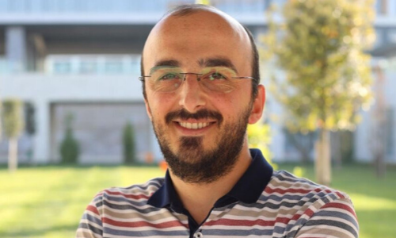

# **Ekonomi ve Ticaret**

_Bu başlık İstanbul Çalıştayına dahildir_

## Karadelik Haftası

**Başlık:** Kapitalizmin Kısa Tarihi

**İçerik Türü:** Video

!!! info ""
    Kapitalizmin tarihsel gelişimini, temel özelliklerini ve eleştirilerini genel hatlarıyla kavrama. Videonun sonunda yer alan “Başka bir sistem mümkün mü?” sorusu, İslami finans sistemine geçiş için düşünsel bir köprü oluşturur.

<iframe width="1078" height="606" src="https://www.youtube.com/embed/xY36Cd8jrks" title="Kapitalizmin Kısa Tarihi" frameborder="0" allow="accelerometer; autoplay; clipboard-write; encrypted-media; gyroscope; picture-in-picture; web-share" referrerpolicy="strict-origin-when-cross-origin" allowfullscreen></iframe>

---

**Başlık:** Economic Systems Explained: Capitalism, Socialism & Mixed Economies

**İçerik Türü:** Video

!!! info ""
    Farklı ekonomik sistemlerin (kapitalizm, sosyalizm, karma sistem) nasıl işlediğini, her birinin avantaj ve dezavantajlarını öğrenmek.

<iframe width="1078" height="606" src="https://www.youtube.com/embed/5DJ7-d8zF_8" title="Economic Systems Explained" frameborder="0" allow="accelerometer; autoplay; clipboard-write; encrypted-media; gyroscope; picture-in-picture; web-share" referrerpolicy="strict-origin-when-cross-origin" allowfullscreen></iframe>

---

**Başlık:** Is Capitalism Actually Broken?

**İçerik Türü:** Eğitici Video

!!! info ""
    Kapitalizmin hangi şartlarda işlevini yitirdiğini veya nasıl sürdürülebilir hale getirilebileceğini anlamak.

<iframe width="1078" height="606" src="https://www.youtube.com/embed/wcR815SfWOU" title="Is Capitalism Actually Broken?" frameborder="0" allow="accelerometer; autoplay; clipboard-write; encrypted-media; gyroscope; picture-in-picture; web-share" referrerpolicy="strict-origin-when-cross-origin" allowfullscreen></iframe>

---

**Başlık:** What Is Inflation? – The School of Life

**İçerik Türü:** Video

!!! info ""
    Enflasyonun sadece ekonomik değil, aynı zamanda toplumsal ve psikolojik bir olgu olduğunu fark etmek. 
    
<iframe width="1078" height="606" src="https://www.youtube.com/embed/UMAELCrJxt0" title="What Is Inflation?" frameborder="0" allow="accelerometer; autoplay; clipboard-write; encrypted-media; gyroscope; picture-in-picture; web-share" referrerpolicy="strict-origin-when-cross-origin" allowfullscreen></iframe>

---

**Başlık:** How Does the Stock Market Work?

**İçerik Türü:** Video

!!! info ""
    Borsanın temel işleyişini, hisse senedi sistemini ve ekonomideki rolünü anlamak.

<iframe width="1078" height="606" src="https://www.youtube.com/embed/p7HKvqRI_Bo" title="How Does the Stock Market Work?" frameborder="0" allow="accelerometer; autoplay; clipboard-write; encrypted-media; gyroscope; picture-in-picture; web-share" referrerpolicy="strict-origin-when-cross-origin" allowfullscreen></iframe>

---

**Başlık:** How Islamic Finance Actually Works

**İçerik Türü:** Video

!!! info ""
    Faizsiz finans sisteminin temel prensiplerini, risk paylaşımı, reel ekonomi ve etik temellerini anlamak.

<iframe width="1078" height="606" src="https://www.youtube.com/embed/r7GKIFHTBTA" title="How Islamic Finance Actually Works" frameborder="0" allow="accelerometer; autoplay; clipboard-write; encrypted-media; gyroscope; picture-in-picture; web-share" referrerpolicy="strict-origin-when-cross-origin" allowfullscreen></iframe>

---

**Başlık:** Hz. Peygamber’in Ticaret Ahlakının Esasları

**İçerik Türü:** Makale

!!! info ""
    Hz. Peygamber’in ticaret anlayışındaki dürüstlük, güven ve adalet ilkelerini öğrenmek.

<embed src="pdfs/hz-peygamber-ahlaki-kisa.pdf" type="application/pdf" width="100%" height="600px">

??? quote "Erişim"

    [Makalenin tamamına bu linkten erişilebilir](https://dergipark.org.tr/tr/download/article-file/4437723)

---

## Kuluçka Haftası

**Konuk:** İsa Yılmaz

**Kuluçka Konusu:** İslami finansla daha sağlam ve adil bir ekonomik sistem kurulabilir mi, bunu nasıl gerçekleştirebiliriz?

**İsa Yılmaz Kimdir?**

- İsa Yılmaz, İstanbul Bilgi Üniversitesi ve University of London çift diploma programı kapsamında 2013 yılında İşletme-Ekonomi Bölümünde Üstün Başarı Programında London School of Economics (LSE) akademik rehberliğinde lisans eğitimini tamamladı. Durham Üniversitesi İslami Finans Bölümünde 2014 yılında “İslami Sosyal Refah Fonksiyonunu Oluşturmak: İslam Ahlak Ekonomisi Açısından Bir Değerlendirme” konulu teziyle yüksek lisans derecesi ve 2019 yılında “İslam Ahlak Ekonomisine Dair: Kalkınmacı Vaatler, Finansallaşma Yanılgısı ve Metodolojik Açmazlar” konulu teziyle doktora derecesi aldı. Hâlen İstanbul Medeniyet Üniversitesi İktisat Bölümünde doçent olarak görev yapmaktadır. Ekonomik kalkınma, finansallaşma ve İslam politik ekonomisi üzerine çeşitli akademik makaleler yayınlamıştır. Ayrıca, gelişmekte olan ekonomiler için adil kalkınma ve refah sonuçları olan özgün modeller öngörmeye çalışan alternatif ekonomik ve finansal sistemleri araştırmaktadır. Bu alanları keşfetmek için ahlaki ekonomi, politik ekonomi, iktisat felsefesi ve alternatif bankacılık ve finans modelleri konularına ilgi duymaktadır.

- <figure markdown="span">
    
    <figcaption><a href="https://scholar.google.com/citations?user=2HmhaOYAAAAJ&hl=en" target="_blank">Doç. Dr. İsa Yılmaz</figcaption>
  </figure>

---

## Süpernova Haftası

**Etkinlik:** İçecek Pazarında Rekabet (Vaka Çalışması)

??? travel "İstanbul"

    Öğrencilerin bir ekonomik sistemin farklı aktörlerini (üretici, yatırımcı, banka, tüketici) somut roller üstlenerek tanımaları, üretimden tüketime kadar ekonomik döngüyü deneyimlemeleri hedeflenir. Bu çalışma ile faiz temelli finans sistemi ile katılım finansı arasındaki farkların görülmesi amaçlanmaktadır.

??? travel "Konya"

    Öğrencilerin bir ekonomik sistemin farklı aktörlerini (üretici, yatırımcı, banka, tüketici) somut roller üstlenerek tanımaları, üretimden tüketime kadar ekonomik döngüyü deneyimlemeleri hedeflenir. Bu çalışma ile faiz temelli finans sistemi ile katılım finansı arasındaki farkların görülmesi amaçlanmaktadır.

??? travel "Antalya"

    Öğrencilerin bir ekonomik sistemin farklı aktörlerini (üretici, yatırımcı, banka, tüketici) somut roller üstlenerek tanımaları, üretimden tüketime kadar ekonomik döngüyü deneyimlemeleri hedeflenir. Bu çalışma ile faiz temelli finans sistemi ile katılım finansı arasındaki farkların görülmesi amaçlanmaktadır.

??? travel "Samsun"

    Öğrencilerin bir ekonomik sistemin farklı aktörlerini (üretici, yatırımcı, banka, tüketici) somut roller üstlenerek tanımaları, üretimden tüketime kadar ekonomik döngüyü deneyimlemeleri hedeflenir. Bu çalışma ile faiz temelli finans sistemi ile katılım finansı arasındaki farkların görülmesi amaçlanmaktadır.

??? travel "Sivas"

    Öğrencilerin bir ekonomik sistemin farklı aktörlerini (üretici, yatırımcı, banka, tüketici) somut roller üstlenerek tanımaları, üretimden tüketime kadar ekonomik döngüyü deneyimlemeleri hedeflenir. Bu çalışma ile faiz temelli finans sistemi ile katılım finansı arasındaki farkların görülmesi amaçlanmaktadır.

??? travel "Erzurum"

    Öğrencilerin bir ekonomik sistemin farklı aktörlerini (üretici, yatırımcı, banka, tüketici) somut roller üstlenerek tanımaları, üretimden tüketime kadar ekonomik döngüyü deneyimlemeleri hedeflenir. Bu çalışma ile faiz temelli finans sistemi ile katılım finansı arasındaki farkların görülmesi amaçlanmaktadır.

??? travel "Gaziantep"

    Öğrencilerin bir ekonomik sistemin farklı aktörlerini (üretici, yatırımcı, banka, tüketici) somut roller üstlenerek tanımaları, üretimden tüketime kadar ekonomik döngüyü deneyimlemeleri hedeflenir. Bu çalışma ile faiz temelli finans sistemi ile katılım finansı arasındaki farkların görülmesi amaçlanmaktadır.
