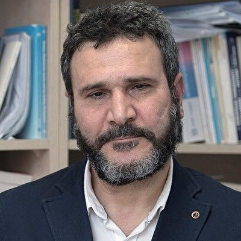

# **Uluslararası Hukuk**

_Bu başlık İstanbul Çalıştay'ına dahildir_

## Karadelik Haftası

**Başlık:** 12 Kızgın Adam (12 Angry Men)

**İçerik Türü:** Film

??? quote "Beyaz Perde Özeti"

    12 Öfkeli Adam, cinayetle suçlanan bir genç ile ilgili karar vermekle yükümlü 12 jüri üyesinin karar verme sürecini konu ediyor. Latin Amerikalı bir genç adam, babasını öldürdüğü gerekçesiyle cinayetle suçlanır. Sanığın kaybettiğini söylediği bir bıçak ise cinayetin işlendiği odada bulunmuştur, gencin mahkemeye sunduğu savunma zayıftır ve olan biteni duyduklarını söyleyen pek çok tanık vardır. Sanık suçlu bulunduğu taktirde idama mahkum edilecektir.Jüri sonuçları pek de şaşırtıcı değildir: 12 jüri üyesinden sadece sekiz numaralı jüri üyesi Davis 'suçsuz' hükmü yönünde oy vermiştir. Davis’in jüri üyelerini ikna etmeye çalışması esnasında her jüri üyesinin 'suçlu' kararı vermesinin arkasında ise, aralarında yabancı düşmanlığı, kanuna aşırı güven, çoğunluğa uyma, geçmişle hesaplaşma gibi farklı kişisel sebepler olduğu ortaya çıkacaktır.

    [Detaylı bilgi için tıklayınız](https://www.beyazperde.com/filmler/film-4063/)

!!! info ""

    Bu film ile farazi bir dava üzerinden hukuk nasıl işlediğini, kendi zihnimizde yaptığımız yargılamalar ve adil bir yargılamanın farklarını anlayabilmek hedeflenmiştir.

<iframe src="https://drive.google.com/file/d/1Eie6Wxno8Q7s6mdQmgnTdwlSg5tpxIC7/preview" width="1078" height="606" allow="autoplay"></iframe>

---

**Başlık:** Adalet Nedir?

**İçerik Türü:** Video

!!! info ""

    Bu video ile adalet kavramının ironik bir söylem üzerinden değerlendirilmesi ve hukukun toplumdaki rolüne dair fikir yürütülmesi hedeflenmiştir.

<iframe src="https://drive.google.com/file/d/1Wm7kYXtiaCUGbCC0KAz03JW02yF5GUrH/preview" width="1078" height="606" allow="autoplay"></iframe>

---

## Kuluçka Haftası

**Konuk:** Berdal Aral

**Berdal Aral Kimdir?**

- 1963 Tarsus doğumlu. Ankara Üniversitesi Siyasal Bilgiler Fakültesi Uluslararası İlişkiler Bölümü’nden mezun oldu (1985). “Turkey and International Society from a Critical Legal Perspective” (Eleştirel Hukuk Açısından Türkiye ve Uluslararası Toplum) başlıklı çalışmasıyla Glasgow Üniversitesi’nde doktorasını tamamladı (1994). Verdiği dersler ve diğer çalışmaları, özellikle uluslararası hukuk ve insan hakları alanında yoğunlaşmıştır. Uluslararası Hukukta Meşru Müdafaa Hakkı (1999) ve Üçüncü Kuşak İnsan Hakları Olarak Kolektif Haklar (2010) adlı kitaplarının yanı sıra, hem yukarıda sözü edilen konularda hem de Türkiye’nin dış politikası alanında Türkçe ve İngilizce olarak yayınlanmış makaleleri vardır. Halen İstanbul Medeniyet Üniversitesi Uluslararası İlişkiler Bölümü’nde öğretim üyesi olarak görev yapmaktadır.
- <figure markdown="span">
    
    <figcaption><a href="https://www.linkedin.com/in/m-g%C3%BCrcan-karakas-521959163/?originalSubdomain=tr" target="_blank">Berdal Aral</figcaption>
  </figure>

---

## Süpernova Haftası

!!! info ""

    Bu başlık ilgili haftada görünür olacaktır.

<!--
??? travel "İstanbul"

??? travel "Konya"

??? travel "Antalya"

??? travel "Samsun"

??? travel "Sivas"
-->
