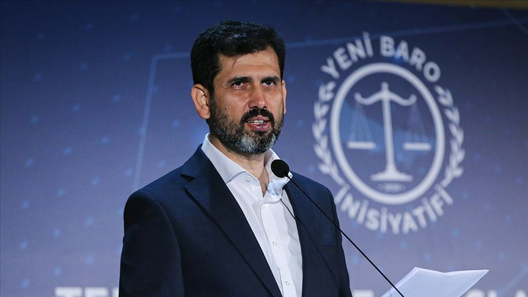

# **Uluslararası Hukuk**

_Bu başlık İstanbul Çalıştay'ına dahildir_

## Karadelik Haftası

**Başlık:** 12 Kızgın Adam (12 Angry Men)

**İçerik Türü:** Film

??? quote "Beyaz Perde Özeti"

    12 Öfkeli Adam, cinayetle suçlanan bir genç ile ilgili karar vermekle yükümlü 12 jüri üyesinin karar verme sürecini konu ediyor. Latin Amerikalı bir genç adam, babasını öldürdüğü gerekçesiyle cinayetle suçlanır. Sanığın kaybettiğini söylediği bir bıçak ise cinayetin işlendiği odada bulunmuştur, gencin mahkemeye sunduğu savunma zayıftır ve olan biteni duyduklarını söyleyen pek çok tanık vardır. Sanık suçlu bulunduğu taktirde idama mahkum edilecektir.Jüri sonuçları pek de şaşırtıcı değildir: 12 jüri üyesinden sadece sekiz numaralı jüri üyesi Davis 'suçsuz' hükmü yönünde oy vermiştir. Davis’in jüri üyelerini ikna etmeye çalışması esnasında her jüri üyesinin 'suçlu' kararı vermesinin arkasında ise, aralarında yabancı düşmanlığı, kanuna aşırı güven, çoğunluğa uyma, geçmişle hesaplaşma gibi farklı kişisel sebepler olduğu ortaya çıkacaktır.

    [Detaylı bilgi için tıklayınız](https://www.beyazperde.com/filmler/film-4063/)

!!! info ""

    Bu film ile farazi bir dava üzerinden hukuk nasıl işlediğini, kendi zihnimizde yaptığımız yargılamalar ve adil bir yargılamanın farklarını anlayabilmek hedeflenmiştir.

<iframe src="https://drive.google.com/file/d/1Eie6Wxno8Q7s6mdQmgnTdwlSg5tpxIC7/preview" width="1078" height="606" allow="autoplay"></iframe>

---

**Başlık:** Adalet Nedir?

**İçerik Türü:** Video

!!! info ""

    Bu video ile adalet kavramının ironik bir söylem üzerinden değerlendirilmesi ve hukukun toplumdaki rolüne dair fikir yürütülmesi hedeflenmiştir.

<iframe src="https://drive.google.com/file/d/1Wm7kYXtiaCUGbCC0KAz03JW02yF5GUrH/preview" width="1078" height="606" allow="autoplay"></iframe>

---

## Kuluçka Haftası

**Konuk:** Cavit Tatlı

**Cavit Tatlı Kimdir?**

- 1995 yılında İstanbul Hukuk Fakültesinde Üniversite hayatına başlayıp 2000 yılında mezun oldu, 2001 yılından itibaren Tatlı Hukuk bürosunu kurup serbest avukatlık yapmaya başladı. 2010 yılında HUKUKÇULAR Derneği’n de görev almaya başlayıp 2011 yılında Hukukçular Derneği Genel Başkanı oldu ve halen devam etmektedir.Çeşitli Gazete ve Dergilerde makale yazmaktadır.Arabuluculuk hizmetinin merkezler üzerinden yapılacağına ilişkin görüş ve düşüncelerin ağır basması üzerine bir çok arabulucu meslektaşla birlikte 2019 yılında Boğaziçi Arabuluculuk ve Tahkim Merkezi A.Ş.yi kurarak Arabuluculuk Mesleğinin kurumsallaşmasına öncülük etmiştir.
  Tüm bunların yanında akademik çalışmaya da önem veren Cavit TATLI, Adalet Bakanlığı Arabuluculuk Daire Başkanlığınca eğitim verecek üniversiteler olarak akredite edilmiş üniversitelerden olan Gedik Üniversitesi’nde İş Hukukunda Uzman Arabuluculuk eğitimi vermektedir.
- <figure markdown="span">
    
    <figcaption><a href="https://www.bogaziciarabuluculuk.com/attorney/cavit-tatli/" target="_blank">Cavit Tatlı</figcaption>
  </figure>

## Süpernova Haftası

!!! info ""

    Bu başlık için süpernova etkinliği bulunmamaktadır.

<!--
??? travel "İstanbul"

??? travel "Konya"

??? travel "Antalya"

??? travel "Samsun"

??? travel "Sivas"
-->
