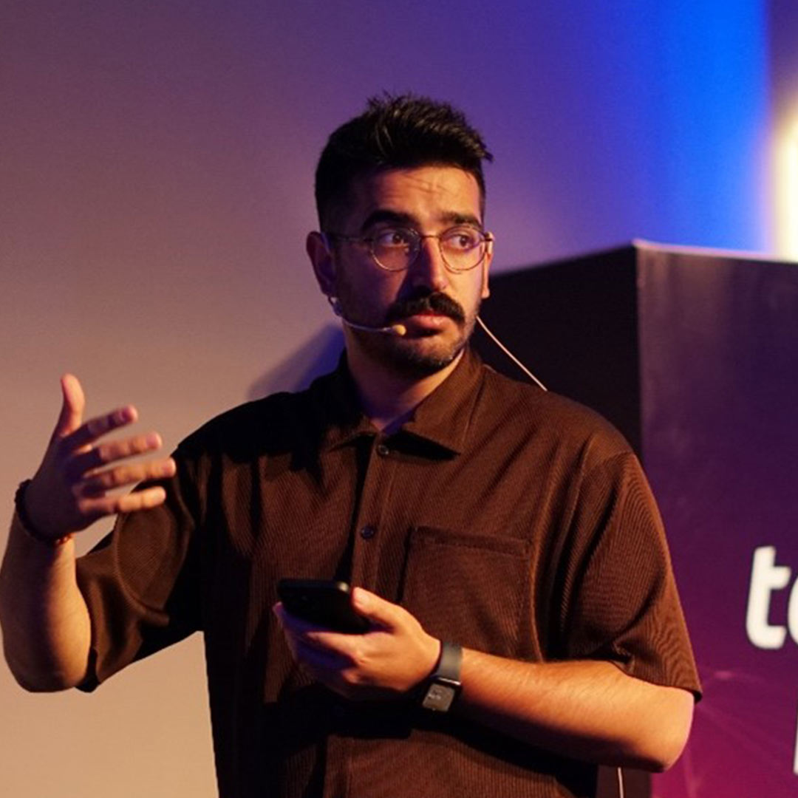

# **Medya ve İletişim**

_Bu başlık İstanbul Çalıştay'ına dahildir_

## Karadelik Haftası

**Başlık:** İfade ve Düşünce Özgürlüğüne Yönelik Dijital Sansür: İsrail’in 7 Ekim Filistin İşgali Bağlamında Betimsel Bir Analiz

**İçerik Türü:** Makale

!!! info ""

    Bu makale, İsrail'in Gazze işgali sırasında Filistin yanlısı paylaşımlar üzerindeki dijital sansür ve gölge yasaklama uygulamalarını incelemektedir. Meta platformuna odaklanarak, bu sansürlerin kullanıcı etkileşimlerini ve ifade özgürlüğünü nasıl kısıtladığını gösteriyor. Bu analiz, öğrencilere dijital sansür ve medya manipülasyonunun sosyal medya üzerindeki etkilerini daha iyi kavrama ve bu süreçlerin gerçek dünyadaki algıları nasıl şekillendirdiğini anlama fırsatı sunacaktır

<embed src="pdfs/İfade ve Düşünce Özgürlüğüne Yönelik Dijital Sansür.pdf" type="application/pdf" width="100%" height="600px">

??? quote "Erişim"

    [Makalenin tamamına bu linkten erişilebilir](https://jacanalysis.com/index.php/pub/article/view/12/9)

---

**Başlık:** İsrail'in Sosyal Medya İstihbarat Ağı: META

**İçerik Türü:** Video

!!! info ""

    Bu video, META’nın sansür politikalarını analiz ederek, Filistin yanlısı içeriklerin adil ve tarafsız bir şekilde moderasyona tabi tutulup tutulmadığını anlamamıza yardımcı olacak bir araştırmayı ele alıyor. Öğrencilerin dijital medya okuryazarlıklarını geliştirerek, medya manipülasyonu konusunda bilinçli bir bakış açısı kazanmalarını sağlayacaktır.

<iframe width="1078" height="606" src="https://www.youtube.com/embed/OzwLVm-6Kko?si=vPmyMN7KKAbcmTz9" title="YouTube video player" frameborder="0" allow="accelerometer; autoplay; clipboard-write; encrypted-media; gyroscope; picture-in-picture; web-share" referrerpolicy="strict-origin-when-cross-origin" allowfullscreen></iframe>

---

**Başlık:** Saf Belge | Gazze Direnişinde Medya Savaşları

**İçerik Türü:** Belgesel

!!! info ""

    Gazze'deki savaşta medya ve sosyal medyada propagandaya karşı gerçeklerin savunulması sorgulanıyor. Üzerine değinilecek birçok kavram bulunması sebebiyle düşünce dünyasını genişleterek yeni kavramlar öğrenilmesini sağlayacak bir belgesel.

<iframe width="1078" height="606" src="https://www.youtube.com/embed/JECqc9Mp0pU?si=FBFd64_9GmMpY6a8" title="YouTube video player" frameborder="0" allow="accelerometer; autoplay; clipboard-write; encrypted-media; gyroscope; picture-in-picture; web-share" referrerpolicy="strict-origin-when-cross-origin" allowfullscreen></iframe>

---

## Kuluçka Haftası

**Konuk:** Doğukan Gezer

**Doğukan Gezer Kimdir?**

- Doğukan Gezer, 1991 İstanbul Beyoğlu’nda doğdu. Lise eğitimini Profilo Anadolu Teknik Lisesi’nde Elektronik Haberleşme bölümünde tamamlamasının ardından Mersin Üniversitesi İletişim Fakültesi Gazetecilik bölümünden mezun oldu. Mezuniyetin ardından Anadolu Üniversitesi’nde Halkla İlişkiler ve Tanıtım Ön Lisansı ile Nişantaşı Üniversitesi’nde Siyaset Bilimi ve Uluslararası İlişkiler Yüksek Lisansı yaptı. İletişim alanındaki akademik eğitimleri sırasında NTV, ATV/Sabah ve Mersin yerel yayınlarında stajyerlik görevi; sonrasında ise sırasıyla 2013 Akdeniz Oyunları’nda Yayın Sorumluluğu, Gençlik ve Spor Bakanlığı’nda Muhabirlik ve Yeni Şafak Dijital Servisi’nde Şef Editörlüğü üstlendi. 2018’den bu yana GZT Yayın Yönetmenliği görevini icra ediyor. 10 yılı aşkın süredir dijital medya alanında içerik ve strateji geliştirilmesi ve uygulanması konularında çalışmalar gerçekleştiriyor.

- <figure markdown="span">
    
    <figcaption><a href="https://www.linkedin.com/in/dogukan-gezer-52350459/?originalSubdomain=tr" target="_blank">Doğukan Gezer</figcaption>
  </figure>

## Süpernova Haftası

!!! info ""

    Bu başlık ilgili haftada görünür olacaktır.

<!--
??? travel "İstanbul"

??? travel "Konya"

??? travel "Antalya"

??? travel "Samsun"

??? travel "Sivas"
-->
