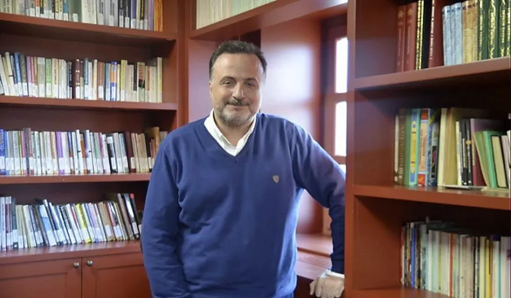

# **Sanat ve Zanaat**

## Karadelik Haftası

**Başlık:** Comme un Chef

**İçerik Türü:** Film

??? quote "Beyaz Perde Özeti"

    Jacky Bonnot, 32 yaşında amatör bir aşçıdır. Gerçekten çok yeteneklidir ve hayali ünlü bir aşçı olup büyük bir restoranda çalışmaktadır. Ekonomik durumu küçük mutfak işlerini kabul edip bu yerlerde de çalışmasını gerektirmektedir; fakat Jacky bu işlerde de bir türlü tutunamaz. Ta ki yıldızlı büyük bir şef olan Alexandre La Garde'la yolları kesişinceye kadar! Kabiliyetli olmanın yanında bir o kadar da inatçı olan Jacky, Lagarde'ın bir türlü anlaşamadığı restoranın yönetim kurulu başkanı Stanislas Matter'ın koltuğunu sarsıp yerine geçirmek için biçilmiş kaftandır. La Garde öte yandan inceleme için kendisini görmeye gelecek yetkililere sunacak yeni bir şeyler bulmak zorundadır ve yardıma ihtiyacı vardır. Ayrıca restoranları da ekonomik çıkmazdan dolayı tehlikededir ve bu ikilinin karşılaşması farklı sonuçlar doğmasına neden olacaktır!

    [Detaylı bilgi için tıklayınız](https://www.beyazperde.com/filmler/film-193511/)

!!! info ""

    Bu film ile bir zanaat olarak gastronomiye eğlenceli bir giriş yapılması hedeflenmiştir. Yalnızca izleyin ve keyif almaya çalışın.

<iframe width="1078" height="606" src="//ok.ru/videoembed/44284185198?nochat=1" frameborder="0" allow="autoplay" allowfullscreen></iframe>

---

**Başlık:** Sanat Kültürel Değişimi Nasıl Şekillendirir? 

**İçerik Türü:** Video

!!! info ""

    Bu video ile zanaat olgusundan sonra sanatın kültürel değişimi nasıl şekillendirdiği sosyolojik olarak ele alınmıştır. Türkçe dil seçeneği için [bu linkten](https://www.ted.com/talks/thelma_golden_how_art_gives_shape_to_cultural_change) de faydalanabilirsiniz.

<iframe width="1078" height="606" src="https://www.youtube.com/embed/1FCihq5n-hE?si=FF5G_FTweYCy1k6a" title="YouTube video player" frameborder="0" allow="accelerometer; autoplay; clipboard-write; encrypted-media; gyroscope; picture-in-picture; web-share" referrerpolicy="strict-origin-when-cross-origin" allowfullscreen></iframe>

---

**Başlık:** Yeryüzü ve Dünya Açısından Sanat 

**İçerik Türü:** Video

!!! info ""

    Bu video ile dijital çağda sanatın dünya için ne ifade ettiği konusuna vurgu yapılmak istenmiştir. 

<iframe width="1078" height="606" src="https://www.youtube.com/embed/a1TaFY1SoD8?si=AH3dKCXxhTQA7WSN" title="YouTube video player" frameborder="0" allow="accelerometer; autoplay; clipboard-write; encrypted-media; gyroscope; picture-in-picture; web-share" referrerpolicy="strict-origin-when-cross-origin" allowfullscreen></iframe>

---

**İleri Okuma**

!!! info ""

    Konular ilginizi çektiyse, tamamen isteğe bağlı olarak bu kaynakları da ziyaret edebilirsiniz.

- Sanat tarihi ile alakalı detaylı bir eğitim seti için [bu linke](https://www.khanacademy.org.tr/kategori.asp?cat=44) tıklayınız.
- Yiyeceğin Serüveni isimli [bu belgesel](https://www.trtbelgesel.com.tr/lezzet/yiyecegin-seruveni) gastronomiden yola çıkarak sofrasına gelen yiyeceğin kökenlerini merak edenler için ayrılmıştır.

---

## Kuluçka Haftası

!!! info ""

    Bu başlık ilgili haftada aktif olacaktır.

<!-- 
**Konuk:** Barbaros Ceylan

**Barbaros Ceylan Kimdir?**

- Barbaros Ceylan, 1984 yılı İTÜ İşletme Mühendisliği bölümünden mezun olmuştur. Doktorasını İstanbul Üniversitesi İktisat bölümünde tamamlamıştır. Selçuklu ve Osmanlı medeniyetlerindeki “Ahilik ve Esnaf/Meslek Teşkilatları”nın “ahlaki” ve “insani” değerlerini üniversitede öğrenim görmekte olan gençlere tanıtmak, farkındalıklarını arttırmak ve meslek hayatına sadece maddi değil, aynı zamanda manevi ve moral “değerler” ile de bakmalarını sağlayacak bir idraki kazandırmak gayesiyle, 2012 yılında Hamilik Okulu Vakfını kurmuştur. Halen Hamilik Okulu Vakfında dersler vermekte ve insani değerlerin topluma yayılması konusunda gayret göstermektedir.

- <figure markdown="span">
    
    <figcaption><a href="https://www.linkedin.com/in/barbaros-ceylan-6b587096/?originalSubdomain=tr" target="_blank">Barbaros Ceylan</figcaption>
  </figure>

-->

---

## Süpernova Haftası

!!! info ""

    Bu başlık ilgili haftada aktif olacaktır.

<!--
??? travel "İstanbul"

    Ekonomi ve ticaret kriterlerinin daha iyi anlaşılabilmesini sağlamak adına örnek bir vaka çalışması düzenlenecektir. Bu vaka çalışmasında öğrenciler iki hafta boyunca öğrendikleri teorik bilgileri uygulama ve anlamlandırma şansı elde edecektir. Bu içerik tüm illerde ortak olarak düzenlenecektir.

??? travel "Konya"

    Ekonomi ve ticaret kriterlerinin daha iyi anlaşılabilmesini sağlamak adına örnek bir vaka çalışması düzenlenecektir. Bu vaka çalışmasında öğrenciler iki hafta boyunca öğrendikleri teorik bilgileri uygulama ve anlamlandırma şansı elde edecektir. Bu içerik tüm illerde ortak olarak düzenlenecektir.

??? travel "Antalya"

    Ekonomi ve ticaret kriterlerinin daha iyi anlaşılabilmesini sağlamak adına örnek bir vaka çalışması düzenlenecektir. Bu vaka çalışmasında öğrenciler iki hafta boyunca öğrendikleri teorik bilgileri uygulama ve anlamlandırma şansı elde edecektir. Bu içerik tüm illerde ortak olarak düzenlenecektir.

??? travel "Samsun"

    Ekonomi ve ticaret kriterlerinin daha iyi anlaşılabilmesini sağlamak adına örnek bir vaka çalışması düzenlenecektir. Bu vaka çalışmasında öğrenciler iki hafta boyunca öğrendikleri teorik bilgileri uygulama ve anlamlandırma şansı elde edecektir. Bu içerik tüm illerde ortak olarak düzenlenecektir.

??? travel "Sivas"

    Ekonomi ve ticaret kriterlerinin daha iyi anlaşılabilmesini sağlamak adına örnek bir vaka çalışması düzenlenecektir. Bu vaka çalışmasında öğrenciler iki hafta boyunca öğrendikleri teorik bilgileri uygulama ve anlamlandırma şansı elde edecektir. Bu içerik tüm illerde ortak olarak düzenlenecektir.

-->