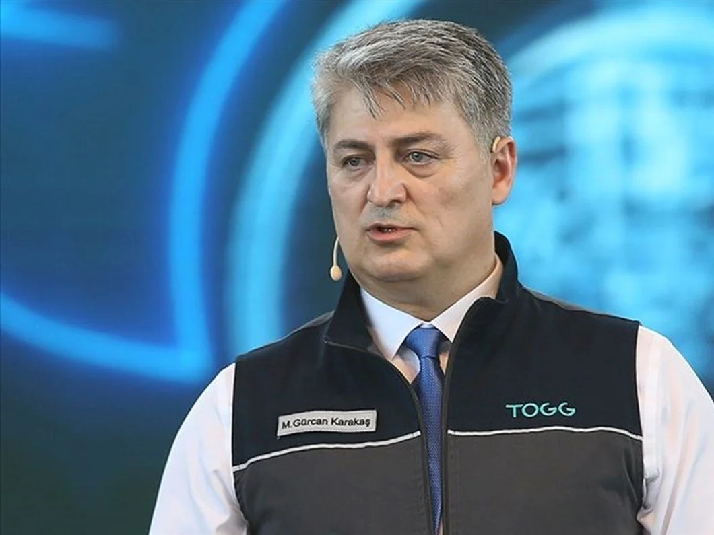

# **Sanayi ve Teknoloji**

## Karadelik Haftası

---

**Başlık:** Devrim Arabaları

**İçerik Türü:** Film

??? quote "Beyaz Perde Özeti"

    1960 yılında 27 Mayıs darbesi sonucu göreve gelen general Cemal Gürsel'in gerçek hikayesinden yola çıkarak oluşturulan Devrim Arabaları adlı filmi babası darbecilikle suçlanan parlak yönetmen Tolga Örnek'in çekmesi ilginç bir tesadüf olmuştur. İhtilalden bir sene sonra Cumhurbaşkanı Cemal Gürsel, uzun zamandır hasretini çektiği yerli üretim bir otomobil yapılmasını emreder ve görevin TCDD işletmesine verildiğini açıklar. Hemen işe koyulan 23 mühendisin önünde bu otomobili yapmak için Cumhuriyet Bayramı’na kadar yalnızca 130 gün vardır. Devrim adı verilecek olan bu arabayı üretmek için 23 mühendis el ele verecek, kariyerlerini ve aile hayatlarını riske atarak zamanla, yoklukla, politikayla, karşılarına çıkan sayısız engelle baş etmek zorunda kalacaktır. Benzini bitti diye yolda kalan araba etiketiyle unutulan Devrim'in hazin hikayesinin bilinen ve bilinmeyenlerinin anlatıldığı Devrim Arabaları filminin senaryosunu, Murat Dişli ve Tolga Örnek 2 yıllık bir araştırma sonucunda oluşturmuşlar. Yardımcı yönetmenlik görevinde ise daha sonra Kuzey ve Güney adlı başarılı dizi filmin yönetmeni olacak Mehmet Ada Öztekin bulunmakta.

    [Detaylı bilgi için tıklayınız](https://www.beyazperde.com/filmler/film-145601/)

!!! info ""

    Bu film ile ülkemizde geçmişten günümüze sanayinin ve üretimin değerlendirilmesi hedeflenmiştir.

<iframe width="1078" height="606" src="https://www.youtube.com/embed/1pExvMoeJjk?si=jVMdDdob1uQ9siwJ" title="YouTube video player" frameborder="0" allow="accelerometer; autoplay; clipboard-write; encrypted-media; gyroscope; picture-in-picture; web-share" referrerpolicy="strict-origin-when-cross-origin" allowfullscreen></iframe>

---

## Kuluçka Haftası

**Konuk:** Gürcan Karakaş

**Gürcan Karakaş Kimdir?**

- Gürcan Karakaş 1965 Antalya Akseki doğumlu. 1988 yılında Ortadoğu Üniversitesi Makine Mühendisliği Bölümü’nden mezun olan Karakaş, aynı yıl Aselsan’da çalışmaya başladı. 1990 yılında Bosch Sanayi ve Ticaret A.Ş’de görev alan Karakaş, 1991-1992 yılları arasında Almanya Feuerbach’ta dizel püskürtme sistemleri ürün geliştirme mühendisi olarak çalıştı. 1995 yılında Bursa’da teknik aplikasyon projelerinden sorumlu kısım müdürü oldu ve 1996-1997 yılları arasında Almanya Bühlertal’da enerji ve karoseri sistemleri üzerine Japon ve İskandinav müşterilerden sorumlu proje müdürü olarak görev aldı. Gürcan Karakaş, 2004 yılında Bosch Türkiye’ye Genel Müdür olarak atandı. 2007 yılında Bosch’un Almanya’daki merkezine geçen Karakaş, o tarihten bu yana grubun yenileme pazarlarından sorumlu Kıdemli Başkan Yardımcısı olarak görev yapıyordu. Karakaş son olarak TOGG’da CEO’luk görevini üstlendi.
- <figure markdown="span">
    
    <figcaption><a href="https://www.linkedin.com/in/m-g%C3%BCrcan-karakas-521959163/?originalSubdomain=tr" target="_blank">M. Gürcan Karakaş</figcaption>
  </figure>

---

## Süpernova Haftası

??? travel "İstanbul"

    İstanbul içerikleri

??? travel "Konya"

    Konya içerikleri

??? travel "Antalya"

    Antalya içerikleri

??? travel "Samsun"

    Samsun içerikleri

??? travel "Trabzon"

    Trabzon içerikleri
